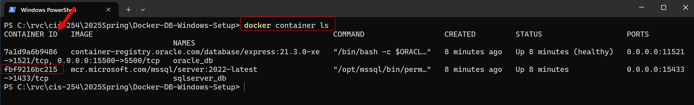
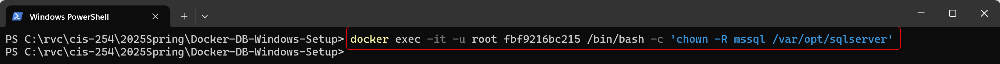
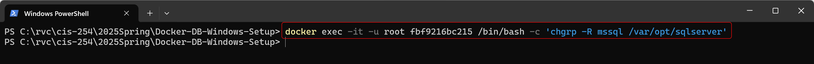

# CIS-254 Database Setup for Windows

___

Welcome to the SQL Server and Oracle Database Container Setup repository for Rock Valley College's CIS-254 Database Programming Class!

This repository provides a pre-configured setup tailored specifically for students of CIS-254 to quickly and reliably set up Developer Edition of the SQL Server and Oracle XE Database containers on Windows using Docker.

## Prerequisites

To use this repository, make sure you:

- Access to Docker Desktop: Install and run Docker Desktop on your Windows machine and setup an account on docker.com to ensure access to pull images from Docker Hub.
- Basic PowerShell Knowledge: Ability to Run a PowerShell Command Window as Administrator and execute simple commands.
- Basic Docker Knowledge: Familiarity with Docker commands and concepts will be helpful but is not required.

## What You'll Find in This Repository

- docker-compose.yml: Defines services for SQL Server and Oracle Database containers.
- .env: A sample environment file to customize configuration values, such as database credentials and ports.

Let’s get started and get our database containers created! 🚀

## Getting started

- Open Docker Desktop.  Ensure that you have logged in using your Docker account to ensure that you can connect to Docker Hub to pull any needed images.
- Open a PowerShell Window as Administrator.
- Navigate to the cloned repository directory using the "cd", change directory command.
- Execute the "docker-compose up -d" command.
- View the created containers under the "Containers" option in Docker Desktop.
- In PowerShell, execute the command "docker container ls" to show some brief information for the containers.  Locate the Container ID for the SQL Server Container.
  
  

- Change the Owner on the sqlserver directory within the container using the following PowerShell command where your_container_id is the Container ID that is shown in the screen shot above:

    ```
      docker exec -it -u root your_container_id /bin/bash -c 'chown -R mssql /var/opt/sqlserver'
    ```

  

- Change the Group on the sqlserver directory within the container using the following PowerShell command where your_container_id is the Container ID that is shown in the screen shot above:

    ```
      docker exec -it -u root your_container_id /bin/bash -c 'chgrp -R mssql /var/opt/sqlserver'
    ```

  

## Testing Database Connections From Container

- Go to the Containers tab in Docker Desktop.  
- Expand the docker-db-windows-setup to show the Oracle and SQL Server containers if they are not already visible.  
- Test the SQL Server Connection
  - Locate the sqlserver_db container.
  - Left click on the three vertical dots to expose a menu of options.  
  - Click on the "Open in Terminal" menu option.
  - Type the following in the terminal window:
  
    ```
    /opt/mssql-tools18/bin/sqlcmd -U SA -P Testing@112233 -No    
    ```

  - This should start a database session.  Type the following at the > prompts:

    ```
    1> SELECT @@VERSION
    2> GO
    ```

  - The database should display it's version as the result of the above query:

    ```
    ------------------------------------------------------------------------------------------------------------------------------------------------------------------------------------------------------------------------------------------------------------------------------------------------------------
    Microsoft SQL Server 2022 (RTM-CU16) (KB5048033) - 16.0.4165.4 (X64) 
        Nov  6 2024 19:24:49 
        Copyright (C) 2022 Microsoft Corporation
        Developer Edition (64-bit) on Linux (Ubuntu 22.04.5 LTS) <X64>                                                                                                      

    (1 rows affected)
    1>
    ```

- Test the Oracle Connection
  - Locate the oracle_db container.
  - Left click on the three vertical dots to expose a menu of options.  
  - Click on the "Open in Terminal" menu option.
  - Type the following in the terminal window:
  
    ```
    sqlplus sys as sysdba    
    ```

  - This should return a prompt asking for the password.  Enter "admin" as the password:

    ```
    SQL*Plus: Release 21.0.0.0.0 - Production on Tue Dec 31 05:16:07 2024
    Version 21.3.0.0.0

    Copyright (c) 1982, 2021, Oracle.  All rights reserved.

    Enter password:
    ```

  - After the password is entered, the connection should be established and the database version is displayed:

    ```
    Connected to:
    Oracle Database 21c Express Edition Release 21.0.0.0.0 - Production
    Version 21.3.0.0.0
    ```

## Database Sample Schema

- Retrieve Oracle Schema files from GitHub location: <https://github.com/oracle-samples/db-sample-schemas/releases/tag/v23.2>
- Retrieve SQL Server Schema files for NorthWinds & Pubs from GitHub location: <https://github.com/microsoft/sql-server-samples/tree/master/samples/databases>
- Retrieve SQL Server Backup file for AdventureWorks from: https://learn.microsoft.com/en-us/sql/samples/adventureworks-install-configure?view=sql-server-ver16&tabs=ssms
